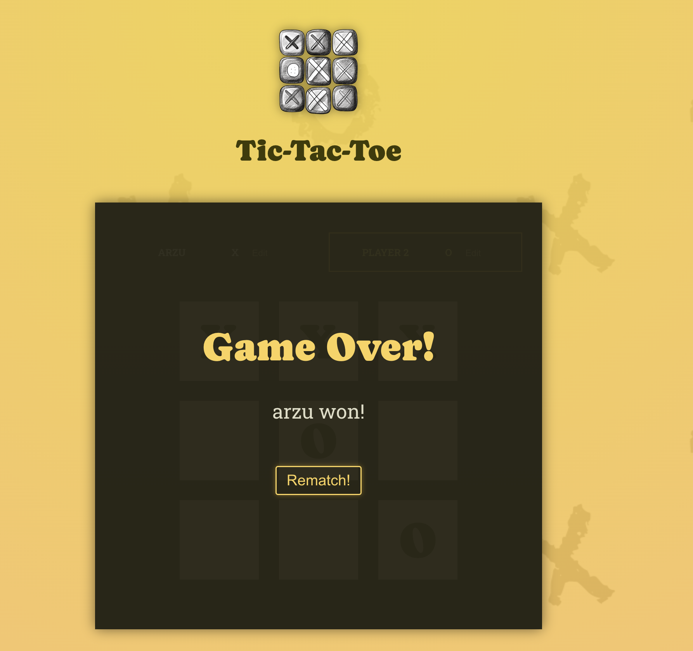

# 🕹️ Tic-Tac-Toe Game

A modern, interactive Tic-Tac-Toe game built with **React**! Play against a friend, customize player names, and track the game history with a clear log. The game includes features for detecting a winner, handling draws, and restarting seamlessly.

---

## 🚀 Features

- **Dynamic Player Switching**: Automatically alternates turns between Player 1 (`X`) and Player 2 (`O`).
- **Customizable Player Names**: Edit and save player names directly in the UI.
- **Real-Time Game Log**: Keeps track of every move, showing which player made each selection.
- **Winner Detection**: Automatically detects and announces the winner based on predefined winning combinations.
- **Draw Detection**: Alerts when all squares are filled and no one has won.
- **Restart Functionality**: Allows players to reset and start a new game instantly.

## 🛠️ Tech Stack

- **Frontend**: React.js
- **State Management**: React `useState`
- **Build Tool**: Vite
- **Linting**: ESLint
- **Version Control**: Git

---

npm run npm run dev

---

## 🖼️ Game Screen

## 🖼️ Game Over Screen

